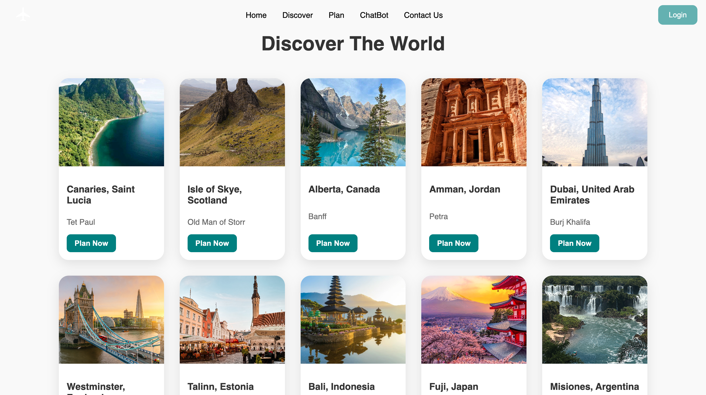
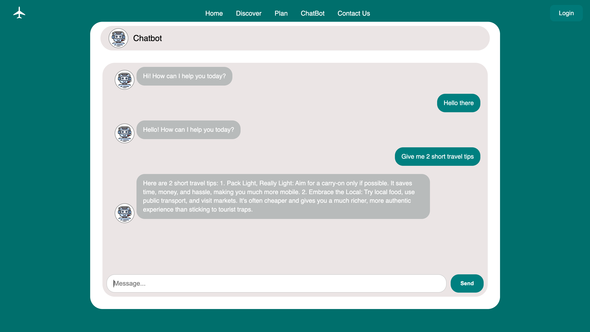
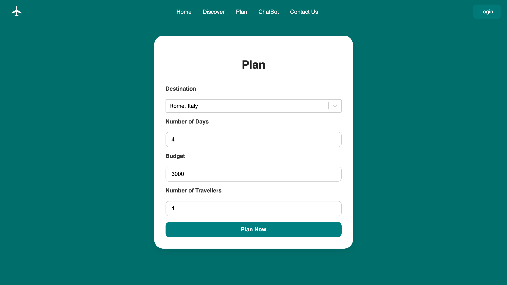
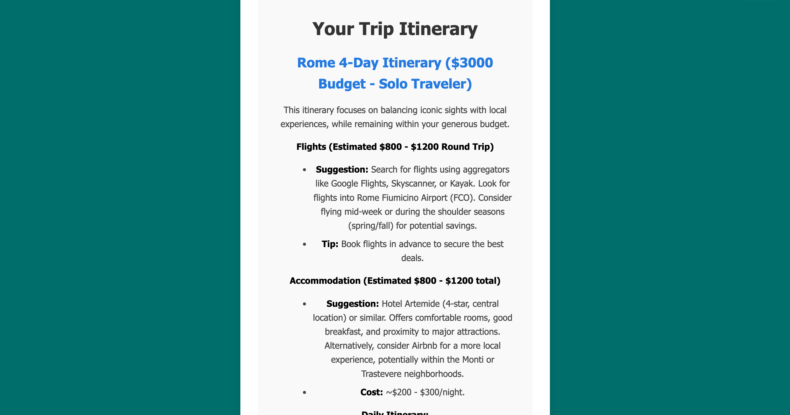

# 🌍 TripWise

Plan luxury travel itineraries effortlessly with AI.  
**TripWise** is a full-stack travel assistant that helps users create personalized trips based on their **budget**, **destination**, and **length of stay** — complete with stunning imagery, live suggestions, and chatbot support.

---

## ✨ Features

- AI-Powered Itinerary Generator
Generate personalized travel plans using Google's Gemini API based on your destination, budget, travel duration, and number of travelers.
Itineraries include daily suggestions with real-world locations, attractions, and activities.

- Interactive Planning Page
Users input trip preferences via a sleek form UI.
Autocomplete support from Google Places helps quickly select destinations worldwide.

- Real-Time Chatbot Assistant
An integrated chatbot answers travel questions instantly, provides follow-up tips, and helps refine trip ideas using AI.
A helpful tool for travel inspiration or clarification.

- Discover Page with Beautiful Imagery
Explore popular or suggested destinations with dynamically rendered content and engaging visuals.
Cleanly organized using React components and responsive design principles.

- Seamless Page Navigation
Client-side routing with React Router allows users to move between pages without refreshes.
Includes smooth anchor scroll behavior for “Discover” and “Contact Us” links.

- Contact Page
Simple, mobile-friendly contact section where users can reach out.
Built with clean layout and responsive styles.

- Responsive UI Design
Built with React, CSS Grid/Flexbox, and custom styling for modern responsiveness.
Optimized for both mobile and desktop.

---

## 📸 Screenshots

### 🏠 Landing Page  

### 🌍 Discover Page  

### 💬 Chatbot Assistant  

### 🧭 Trip Planner  

### 🗓️ Itinerary Generator  

---

## 🧱 Tech Stack

### Frontend
- ⚛️ React  
- 📍 Google Places Autocomplete  
- 🔁 React Router  

### Backend
- 🛠️ Node.js + Express  
- 🧠 Gemini (Google Generative AI)  
- 🔐 dotenv for environment variable management  
